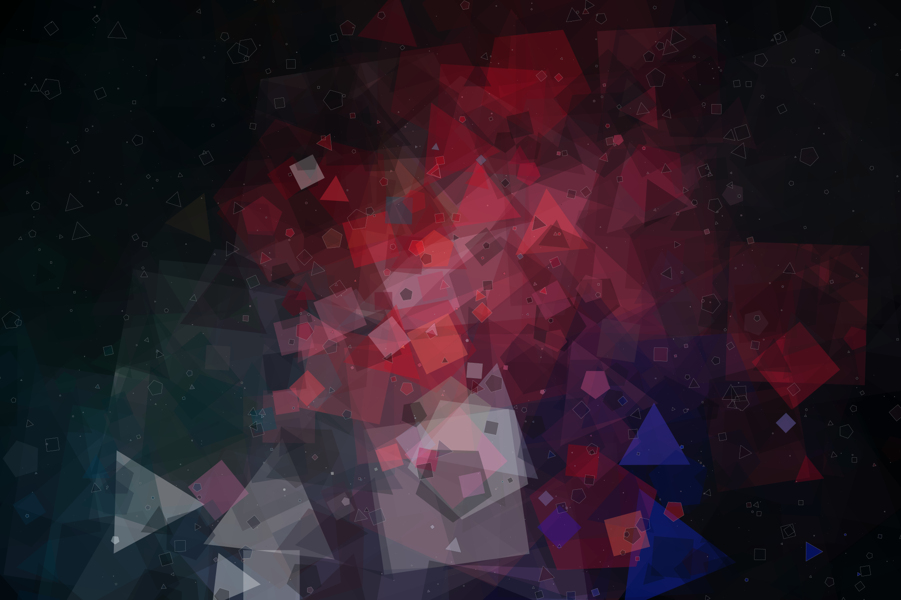

# Generative Art

This is my personal project for making Generative Art.

## Installation

There are getting the binary. You can either download from the [releases page,](https://github.com/chilipepperhott/generative-art/releases) or, if you have `cargo` installed, you can run:

```bash
cargo install --git https://github.com/chilipepperhott/generative-art generative-art
```

## Structure

There are two crates: 

* generative-art: algorithms for generation.
* ga-web: a web interface for the project. You can try it out on [my website](https://elijahpotter.dev/art).

### Generative art

Right now, there are just two generators:

* Preslav: the Rust implementation of Preslav Rachev's book *Generative Art in Go*.
* Celestial: simulates and renders the motion of celestial objects.



