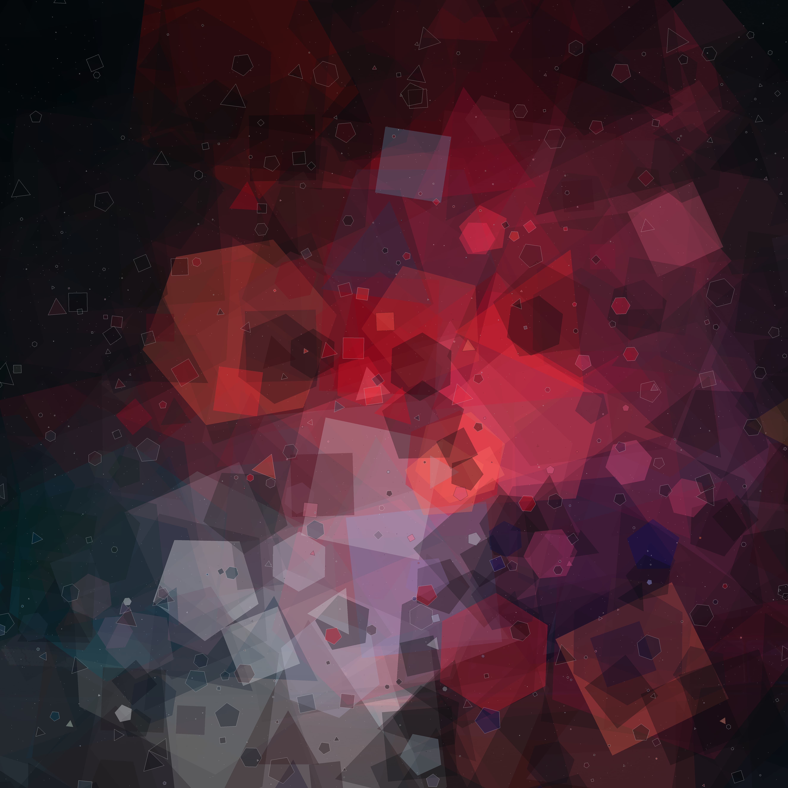

# Generative Art

This is my personal project for making Generative Art.

## Structure

There are three crates: 

* generative-art: algorithms for generation.
* ga-cli: a command line interface.
* ga-web: a web interface for the project. You can try it out on [my website](https://elijahpotter.dev/art).

### Generative art

Right now, there are just two generators:

* Preslav: the Rust implementation of Preslav Rachev's book *Generative Art in Go*.
* Celestial: simulates and renders the motion of celestial objects.

